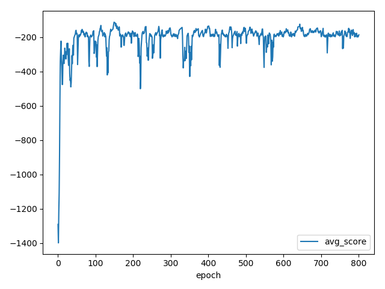
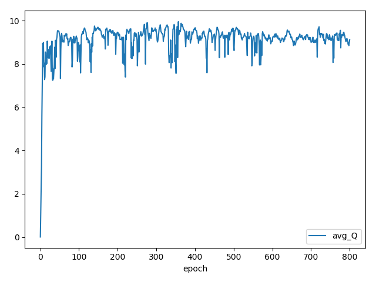

# StrongIndependentEmpoweredPendulum
This is a repo implementing the Unsupervised Real-Time Control through Variational Empowerment paper by Karl, et Al.
At the moment, only the computation of empowerment is being analyzed. Next step is to feed it back into the DDPG algorithm. Empowerment measure rises the better the agent performs. However, the computation presents extremely high undesirable peaks.

